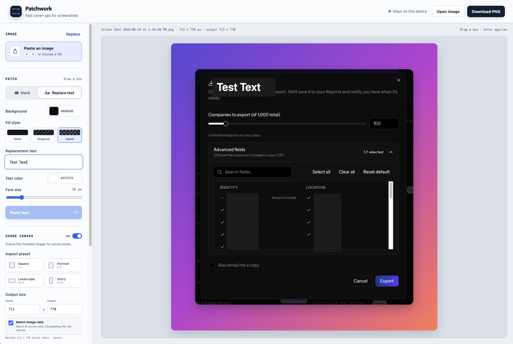

# Patchwork

Patchwork is a fast, local image redaction and screenshot-markup tool. Paste, drop, or open images; arrange them in layers; then mask, blur, crop, label, and annotate without uploading anything.

## Preview

## Features

- Paste, drag/drop, or upload one or multiple PNG, JPG, WebP, and GIF images
- Selectable image layers that can be moved, resized, reordered, and removed
- Free image-layer placement across the full Share canvas, including its padding area, with transparent space around moved or resized images
- Solid, diagonal, and crosshatch fills
- Editable Gaussian and pixelized blur masks with adjustable strength
- Replacement text with custom background, text color, and font size
- Per-tool remembered settings, so masks, text, blur, and marker tools keep independent styles
- Selectable masks, blur areas, text, circles, arrows, and lines that can be moved or resized after placement
- Tools apply as soon as you release the pointer
- Clean or hand-drawn marker circles, arrows, and lines with remembered color, stroke size, and adjustable roughness
- Bendable arrows and lines with a simple middle curve handle
- Dedicated drag-to-crop mode with dimension-safe undo and redo
- Non-destructive workspace zoom, Fit, and drag-to-pan controls
- Ten recent tool presets, with reused settings promoted to the top
- Optional gradient or transparent presentation canvas with six curated backgrounds and an export-ready soft reflection effect
- Square, portrait, landscape, and story presets plus custom pixel dimensions
- Source-size output and optional image-ratio locking for edge-to-edge framing
- Adjustable presentation padding, rounded image corners, and zero-padding transparent corners
- Undo, redo, keyboard controls, clipboard copy, and PNG export
- Preferences, recent presets, layered documents, and editable image history saved locally in the browser
- No uploads or server-side image processing

## Use

Download the files and open `index.html` in a browser. No dependencies are required.
