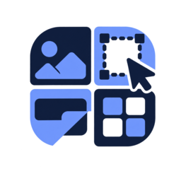

# Patchwork

Patchwork is a fast, local image redaction and screenshot-markup tool. Paste, drop, or open images; arrange them in layers; then mask, blur, crop, label, and annotate without uploading anything.

## Preview

## Features

- Paste, drag/drop, or upload one or multiple PNG, JPG, WebP, and GIF images
- One-click New canvas action that saves the current document to Recent Images before resetting the workspace
- Selectable image layers that can be moved, resized, reordered, and removed
- A separate Share canvas background that keeps image layers and edits together on the original editable surface
- Solid, diagonal, and crosshatch fills
- Editable Gaussian and pixelized blur masks with adjustable strength
- Replacement text with custom background, text color, font size, style, and remembered Sans, Serif, Mono, or handwritten font choices
- Per-tool remembered settings, so masks, text, blur, and marker tools keep independent styles
- Selectable masks, blur areas, text, circles, arrows, and lines that can be moved or resized after placement
- Browser-local Smart Text OCR for finding repeated words or phrases, previewing changes, and bulk removing, blurring, masking, or replacing selected matches
- Smart Text replacement typography detection with global font, weight, and size controls plus per-match weight and size overrides
- Tools apply as soon as you release the pointer
- Clean or genuinely irregular hand-drawn marker circles, arrows, and lines with remembered color, stroke size, adjustable roughness, and open-ended rough circles
- Bendable arrows and lines with a simple middle curve handle
- Dedicated drag-to-crop mode with dimension-safe undo and redo
- Non-destructive workspace zoom, Fit, and drag-to-pan controls
- Ten recent tool presets, with reused settings promoted to the top
- Optional gradient or transparent presentation canvas with six curated backgrounds and one export-ready reflection of the combined visible image layout
- Square, portrait, landscape, and story presets plus custom pixel dimensions
- Optional blur-safe output that keeps the edited image at 1:1 pixels while growing the canvas around the selected aspect ratio
- Fixed-size social presets, rounded editable-canvas corners, and zero-padding transparent corners
- Undo, redo, keyboard controls, clipboard copy, and PNG export
- Preferences, recent presets, layered documents, and editable image history saved locally in the browser
- No uploads or server-side image processing

Smart Text loads Tesseract.js and its English recognition model from jsDelivr on first use, then performs recognition locally in the browser. Image pixels are not sent to an OCR service.

## Use

Download the files and open `index.html` in a browser. The editor has no build step; Smart Text needs an internet connection the first time its OCR engine and English model are cached.
